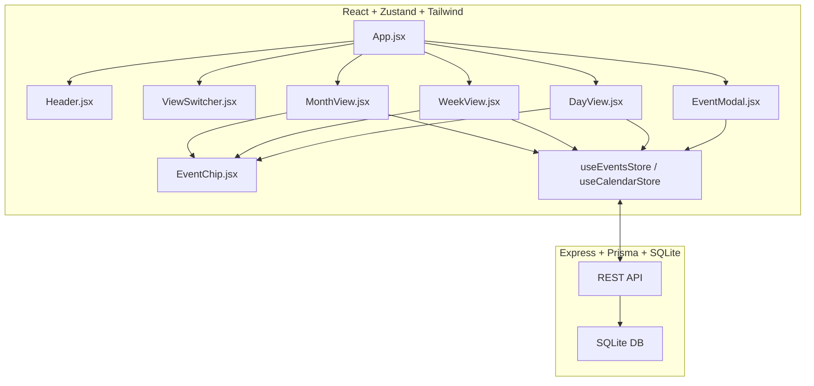

# Google Calendar Clone (React + Zustand + Tailwind)

## 📅 Overview

A polished Google Calendar clone built in React 19, featuring:

- Month, Week, and Day views
- Event creation, editing, and deletion via modal
- Responsive design, modern UX, and optimized state management with Zustand
- Full visual polish with Tailwind CSS

***

## 🚀 Features

- Month, Week, and Day grid views with navigation
- Click empty cell or button to create an event
- Click event chip to edit (modal with full detail pre-fill)
- Real-time event updates (Zustand state, no page refresh)
- Google Calendar-inspired color palette and layout
- Keyboard/focus accessibility (modal and view switches)
- Persistent storage with a simple backend (SQLite + Express + Prisma)

***

## 🛠️ Tech Stack

- **Frontend:** React 19, Zustand, Tailwind CSS, DayJS, Vite
- **Backend:** Node.js (Express), Prisma, SQLite

***

## 🖥️ Screenshots

> *(Insert screenshots of Month view, Week view, Day view, and Event Modal for demo readiness)*

***

## 🏃‍♂️ Getting Started

### 1. Clone the repository

```bash
git clone https://github.com/satagar/gcal.git
cd gcal
```


### 2. Install Backend

```bash
cd calendar-app/backend
npm install
# Start backend server
npm run dev
```

- The backend runs at `http://localhost:3001`
- Event database: SQLite (`dev.db`) auto-created


### 3. Install Frontend

```bash
cd ../frontend
npm install
npm run dev
```

- Access frontend at `http://localhost:5173`

***

## 🧪 Usage

- **Add Event:** Click `+ Create Event` or blank slot/cell in any view
- **Edit Event:** Click any event chip in any view
- **Delete Event:** Use the delete button in the modal
- **Switch Views:** Use the "Month/Week/Day" toggle in header
- **Responsive:** Works great on mobile, tablet, and desktop

***

## 🗂️ Project Structure

```
├── backend/
│   └── Express+Prisma SQLite API
├── frontend/
│   ├── src/components
│   │   └── MonthView.jsx, WeekView.jsx, DayView.jsx, EventModal.jsx ...
│   ├── src/stores
│   ├── src/index.css
│   └── App.jsx
└── README.md
```


***

## 🧩 Key Implementation Notes

- Events are stored in SQLite (persistent)
- State is managed with Zustand; no Redux needed
- Modal and grid event logic avoids race-conditions (uses event.stopPropagation)
- Visual polish: All core Google Calendar UX conventions implemented
- Easily extensible for recurring events, calendar sharing, or drag-and-drop (outlined in comments)

***

## 🗺️ Architecture Diagram *(Optional)*



***

## 💡 Design Decisions \& Interview Tips

- Used Zustand for "just enough" state management, avoiding Redux boilerplate
- Used Tailwind for rapid visual parity with Google Calendar and easy variant styling
- Click handling logic carefully splits "create" vs. "edit" modal
- Backed by a real DB, not just in-memory state—shows full-stack skills


### If Given More Time

- Drag-and-drop rescheduling
- Recurring events
- User authentication \& multi-calendar support
- Advanced filtering/search

***

## 🧹 Scripts \& Commands

- **Backend:** `npm run dev`
- **Frontend:** `npm run dev`
- **Build:** `npm run build` (frontend)

***

## 👨‍💻 Author

- [Satish Agarwal](https://github.com/satagar)

***